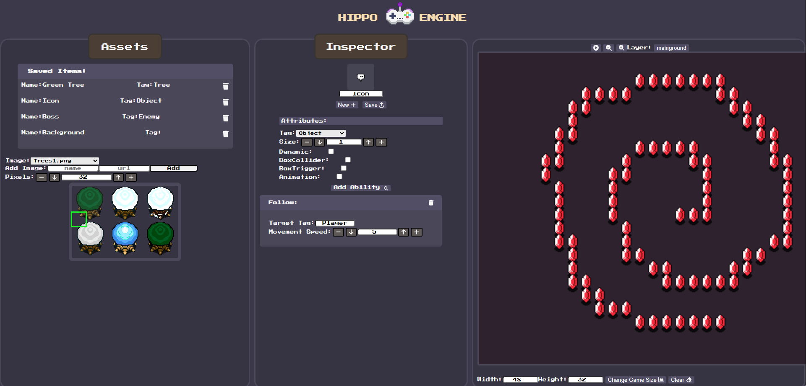

# **ANGULAR-GAME-MAKER: HIPPO ENGINE**
### **Description:**
A web based Game Engine made using only Angular, Typscript, HTML, and CSS, designed specifically for _2D_ game development 

### **Link To Site:**
[site](https://glittering-pavlova-cf89fa.netlify.app)

### **Early Project Demo:**
[demo](https://youtu.be/22Wo9riPfmc)

## **Autor:**
Michele Akeson

### **Purpose/Use:**
This Game Maker is designed to help users design simple 2D games (either top-down or side-view) which can be run efficiently in the browser, due to several system optimizations. The Hippo Engine Game Maker uses several **OOP design patterns**, specifcally the Decorator, and Observer patterns, allowing more robust code that is flexible and easily extendable

#### **NOTE:**
This is the provided public repo for the Angular Web Game Maker (informally known by many as "Hippo Engine", "Pain Main", "Big Water Rino - the Game Editor", and so on...). It's a fun little passion project that I hope you get the chance to mess aorund with!  

### **TO DO:**
1. Create more features/abilities that can be added to game entities
2. Update child gameObject collision detection
